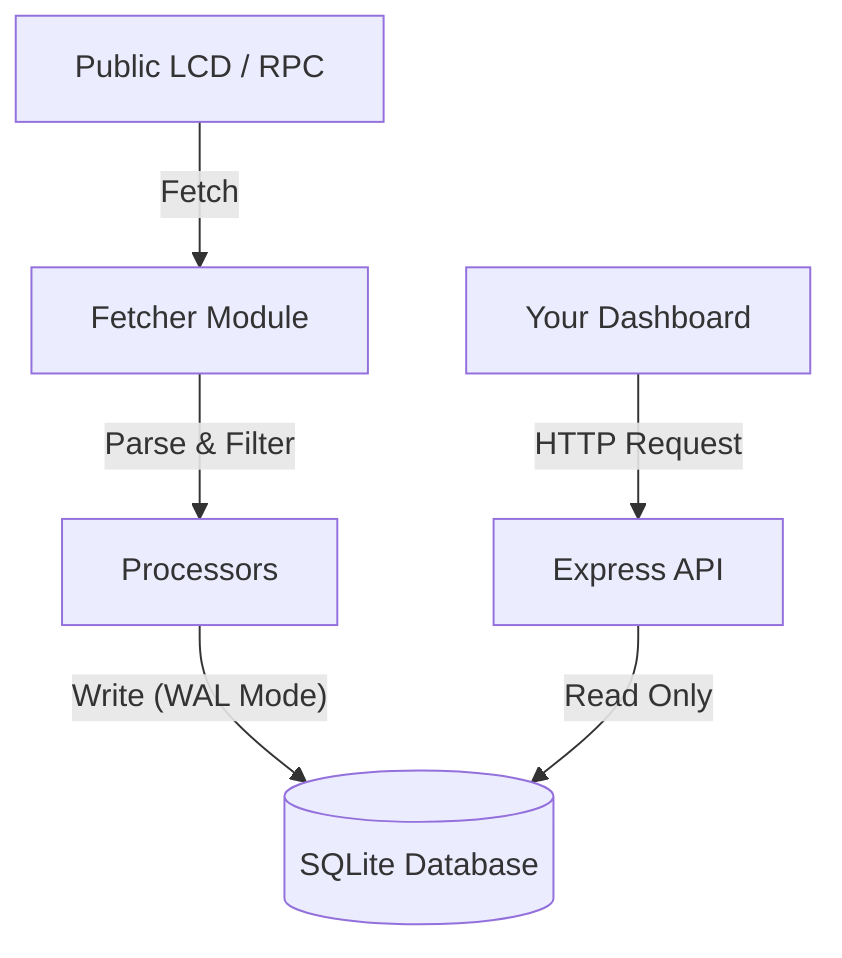

# Cosmos Light Indexer ⚛️

A lightweight, robust, and multichain indexer designed specifically to track **Validator Reputation, Governance, History & Network Upgrades** on Cosmos SDK chains.

Unlike full-node indexers (like Juno or BDJuno) that require PostgreSQL and heavy hardware, this tool uses **SQLite** and connects to public API/LCD endpoints to scrape and persist data. It is engineered to be resilient against public node rate limits and pagination issues.

## 🚀 Features

* **Validator Lifecycle Tracking:** Records initial creation and every subsequent change (Moniker, Website, Commission changes) with "Before vs After" diffs.
* **Growth Tracking:** Captures daily snapshots (at 23:55 UTC) of delegator counts and voting power for historical charting.
* **Genesis Import:** Automatically parses `genesis.json` to populate initial validator data (GenTXs & State).
* **Incident History:** Tracks `MsgUnjail` events to build a history of slashing/downtime incidents.
* **Governance Activity:** Records voting history per validator (`YES`, `NO`, `ABSTAIN`, `NWV`) and tally summaries.
* **Upgrade Detection & History:** 
    * Tracks **complete upgrade history** (past, present, and future upgrades)
    * Records **actual upgrade execution time** when upgrades occur on-chain
    * Monitors **active upgrade plans** with real-time countdown and ETA
    * Supports **multiple proposal formats** (modern, legacy, v1beta1)
* **Smart Sync:**
    * **Initial Snapshot:** Fetches current state from Staking API.
    * **Resilient Backfill:** Uses a **Sequential Block Crawler** to scrape historical data from block 0 to present, bypassing broken pagination on public nodes.
    * **Live Monitoring:** Auto-loops to fetch new data.
* **Multichain Support:** Configure multiple chains in a single `config.yaml`.
* **Lightweight Database:** Uses **SQLite** with WAL (Write-Ahead Logging) mode.

## 🛠 Prerequisites

* Node.js (v16 or higher)
* NPM or Yarn
* A Linux VPS or Local Machine (Minimal resources required: 1CPU, 2GB RAM).

## 📦 Installation

1.  **Clone the repository:**
    ```bash
    git clone https://github.com/astrostake/cosmos-light-indexer.git
    cd cosmos-light-indexer
    ```

2.  **Install dependencies:**
    ```bash
    npm install
    ```

3.  **Configure Chains:**
    Copy the example config and edit it:
    ```bash
    cp config.example.yaml config.yaml
    nano config.yaml
    ```

## ⚙️ Configuration (`config.yaml`)

Define your chains here. You can use public endpoints.

```yaml
chains:
  - name: "lumera"
    api_url: "https://lcd.lumera.io"        # Must be a valid LCD endpoint
    prefix_acc: "lumera"                    # Address prefix (e.g., cosmos, osmo)
    prefix_val: "lumeravaloper"             # Valoper prefix
    query_param: "query"                    # Use "query" (Legacy/Default) or "events" (SDK v0.50+)
    db_file: "./data/lumera.db"             # Location of the SQLite file
    genesis_file: "./genesis/lumera.json"   # Optional: For Genesis Import

  - name: "paxinet"
    api_url: "https://mainnet-lcd.paxinet.io"
    prefix_acc: "paxi"
    prefix_val: "paxivaloper"
    query_param: "query"
    db_file: "./data/paxi.db"
```

## 🏃‍♂️ Usage
We recommend running the Indexer (Writer) and API Server (Reader) simultaneously using PM2.

1. **Start the Indexer (Background Worker)**
    This script fetches data and writes to SQLite.
    ```bash
    node index.js
    # Or with PM2
    pm2 start index.js --name "indexer-worker"
    ```

2. **Start the API Server**
    This script serves the data to your dashboard/frontend.
    ```bash
    node server.js
    # Or with PM2
    pm2 start server.js --name "indexer-api"
    ```

## 🔌 API Endpoints

Base URL: `http://localhost:3002`

| Method | Endpoint | Description |
| :--- | :--- | :--- |
| `GET` | `/:chain/validators` | List all validators with current stats. |
| `GET` | `/:chain/validators/:addr` | Get detailed profile, history of edits, unjails, and votes. |
| `GET` | `/:chain/validators/:addr/delegations-history` | Get daily stats for charts. Supports `?range=7/30/90/all`. |
| `GET` | `/:chain/proposals/:id/votes` | Get vote summary and individual validator votes for a proposal. |
| `GET` | `/:chain/upgrade` | Get active software upgrade plan and estimated ETA. |
| `GET` | `/:chain/upgrades/history` | Get complete upgrade history. Supports `?status=completed/scheduled/all`. |
| `GET` | `/:chain/upgrades/:planName` | Get specific upgrade details by plan name. |
| `GET` | `/:chain/stats` | Get global indexing stats. |

**Example:**
`http://localhost:3002/lumera/validators/lumeravaloper1...`

## 🏗 Architecture



## ⚠️ Notes on Public Nodes

If you are using public endpoints:

### Rate Limiting
* The script has built-in exponential backoff with retry logic
* If it stalls or prints "Rate Limited", it will resume automatically
* Uses smart delays between requests (200ms default)

### Initial Sync
* The indexer uses a **Sequential Block Crawler** mechanism to ensure no data is missed
* This may take time depending on chain height (expect 1-3 hours for chains with 1M+ blocks)
* Progress is logged in real-time with checkpoints saved

### Data Availability
* If a node prunes old transactions (returns 404 for old blocks), the indexer cannot retrieve that specific history
* Use an **Archive Node** for best results and complete historical data
* Genesis file import helps populate initial validator data

### Upgrade Detection
* **Pagination Support:** Automatically handles chains with 100+ proposals
* **Legacy Format Support:** Detects old proposal formats (MsgExecLegacyContent)
* **Multi-Page Fetching:** No upgrade proposal is missed regardless of pagination

## 🤝 Contribution

Pull requests are welcome! Please check the `src/processors` folder if you want to add support for more transaction types.

## 📄 License

MIT